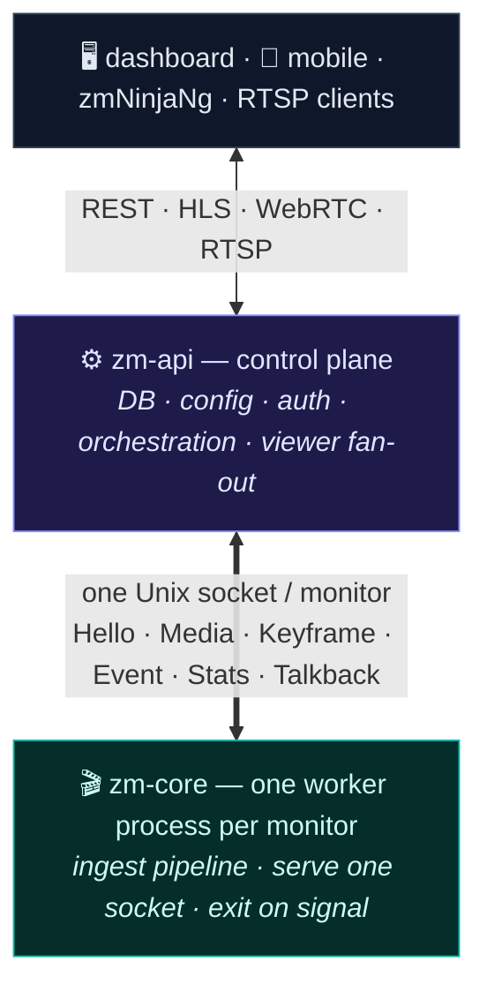
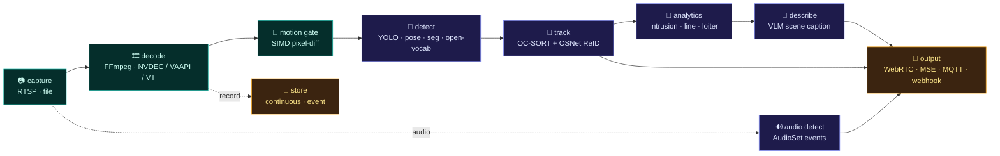

<div align="center">

# ⚡ ZM-Next

### A plugin-based video pipeline engine — the next-generation ZoneMinder core

*Capture → Decode → Detect → Record, as a graph of hot-swappable plugins, each on its own thread, wired together by JSON.*


</div>

---

## What is this?

**ZM-Next** is a ground-up rewrite of ZoneMinder's C++ core (`zmc` capture + `zma` analysis) as a
single, supervisable **per-monitor worker**. It loads a pipeline described in JSON, dynamically
`dlopen`s a set of plugins, wires them into a `capture → decode → detect → output` graph, and runs
each stage in its own thread behind a stable C ABI.

It is **not** a standalone system — it's the media+AI engine that a control plane (`zm-api`) spawns,
one process per camera, and talks to over a single Unix-domain socket. The worker stays "dumb": it
ingests a generated pipeline, serves one socket carrying media + events + control, and exits cleanly
on a signal. All persistence, policy, auth, and viewer fan-out live upstream.

**System context** — the worker is the dumb, supervisable media+AI engine; the control plane owns everything stateful and is the only public surface.



**Inside the worker** — a graph of hot-swappable plugins, each on its own thread behind a bounded drop-oldest queue, all speaking one C ABI with frames zero-copy where possible (incl. GPU):



> ⚡ **On NVIDIA**, `decode_detect` fuses NVDEC decode + ROI-motion + YOLO into one zero-copy GPU stage, and a shared batched engine coalesces frames **across cameras** into single inference passes.

## ✨ Highlights

- **🧩 Plugin ABI** — every stage is a shared library exporting one C symbol (`zm_plugin_init`).
  Input, process, detect, output, and store plugins are independent `.dylib`/`.so`s with hidden
  symbols and a stable contract (`core/include/zm_plugin.h`).
- **🧵 Per-stage threading** — a slow AI detector can't stall recording or streaming. Each non-input
  plugin runs on its own thread with a **bounded, drop-oldest** queue (`queue_depth` per node), so
  load is shed at the stage that's overloaded, never propagated backwards.
- **🔌 One canonical worker protocol** — a 24-byte binary stream-socket wire (byte-compatible with the
  ZoneMinder `zmc` producer and the Rust control plane's consumer); media (Annex-B) + TLV `Hello`/`Event`
  on one socket. The bulk media payload rides *alongside* the header (`writev`, refcounted buffers) —
  **zero payload copies**.
- **🎥 Codec & hardware aware** — `decode_ffmpeg` auto-detects the input codec (H.264/HEVC/MJPEG/…)
  from the stream handshake and supports configurable hwaccel (CUDA / VideoToolbox / VAAPI / QSV).
  Audio is carried end-to-end; two-way audio (talkback) is in the contract.
- **🧠 An AI tier, not a bolt-on** — embedded ONNX Runtime detection (YOLO, open-vocab, pose,
  segmentation, face, LPR), AudioSet-style audio-event classification, **OC-SORT** tracking with
  appearance (**OSNet ReID**) gating, zone/line analytics, and VLM scene description — all
  JSON-configurable, with an optional **GPU zero-copy** decode→inference path (NVDEC → on-GPU
  detect → cross-camera dynamic batching), validated on Linux/NVIDIA.
- **✅ Proven end-to-end** — a runnable, camera-free proof drives capture → decode → motion → detect
  + recording and observes the worker socket; an integration smoke suite guards it in CI.

## 🗂️ Plugin catalog

| Stage | Plugins |
|---|---|
| **Input** | `capture_rtsp_multi` (multi-stream RTSP + audio), `capture_file` (file replay, loop, audio) |
| **Decode / Encode** | `decode_ffmpeg` (auto codec + hwaccel), `decode_detect` (fused NVDEC decode + on-GPU detect in one synchronous stage), `encode_ffmpeg` (H.264/HEVC, nvenc/videotoolbox/…) |
| **Motion / pre-filter** | `motion_gate` (SIMD pixel-diff gate), `zones` (R-tree spatial index), `motion_pixel_diff`, `motion_hybrid` |
| **Detect** | `detect_onnx` (YOLO + optional OSNet **ReID** embeddings, +CUDA zero-copy & shared cross-camera batched engine), `detect_openvocab`, `detect_pose`, `detect_seg` |
| **Recognize** | `recognize_face` (detector + embedder gallery), `lpr` (plate detect + OCR) |
| **Audio** | `audio_detect` (windowed audio-event classification; raw-waveform *or* log-mel front-end — YAMNet / PANNs / CED / EfficientAT) |
| **Track / Analyze / Understand** | `tracker` (**OC-SORT**: Kalman + ByteTrack two-stage, appearance-gated ReID), `analytics_rules` (intrusion / line-cross / loiter), `alert_policy` (collapse per-frame detections into per-object alerts), `describe_vlm` (scene description via a VLM server), `llm_event_review` (LLM montage review + track-close narrator) |
| **Output** | `output_webrtc`, `output_mse`, `output_mqtt`, `output_webhook` |
| **Store / Export** | `store` (`mode` = continuous keyframe-aligned rotation / event pre-roll+post-roll / both), `store_snapshot`, `review_export` (motion-synopsis tubes + plate refs for the renderer) |
| **Utility** | `overlay`, `privacy_mask`, `hello` (reference plugin) |

Every plugin's config keys are documented in **[docs/Plugin_Config_Reference.md](docs/Plugin_Config_Reference.md)**.

## 🚀 Quickstart

**Prerequisites** — CMake, a C++20 toolchain, [vcpkg](https://github.com/microsoft/vcpkg)
(`VCPKG_ROOT` set, or present at `~/vcpkg`), and Homebrew packages: FFmpeg ≥ 7.0, `onnxruntime`,
`xsimd`, `nlohmann-json`, `boost`, `mosquitto`.

```bash
./build.sh            # configure (Debug) + build into build/
./build.sh test       # build, then run the full ctest suite
./build.sh clean      # wipe build/ and rebuild
```

**Run the engine** (from `build/` — plugin paths resolve relative to the working directory):

```bash
cd build
# end-to-end demo: file → decode → motion → detect, + recording, served on a worker socket
./zm-core --pipeline ../pipelines/e2e_file_cascade.template.json \
          --socket /tmp/stream_1.sock --monitor-id 1

# watch the worker socket with the reference consumer
./wl_dump /tmp/stream_1.sock 7      # prints Hello / Media / Event / Stats
```

## 🧱 A pipeline is just JSON

Pipelines are declarative trees of plugin nodes — `id`, `kind` (resolves to `plugins/<kind>/<kind>.dylib`),
a `cfg` object, an optional `queue_depth`, and `children`:

```jsonc
{
  "root": true,
  "plugins": [
    { "id": "capture", "kind": "capture_file",
      "cfg": { "path": "/tmp/clip.mp4", "realtime": true },
      "children": [
        { "id": "decode", "kind": "decode_ffmpeg", "cfg": { "output_format": "rgb24" }, "queue_depth": 8,
          "children": [
            { "id": "motion", "kind": "motion_gate", "cfg": { "frame_width": 1280, "frame_height": 720 },
              "queue_depth": 4,
              "children": [
                { "id": "detect", "kind": "detect_onnx", "cfg": { "model_path": "yolo.onnx" }, "queue_depth": 2 }
              ] }
          ] },
        { "id": "store", "kind": "store", "cfg": { "mode": "continuous", "root": "/data/rec" }, "queue_depth": 120 }
      ] }
  ]
}
```

`queue_depth` is the load-handling knob: small (2–4) for low-latency detectors that should always
work the freshest frame, large (~120) for recorders that must not drop.

## 🔭 The worker socket

One Unix-domain socket per monitor, speaking the canonical binary stream-socket protocol
(`core/include/zm/stream_socket_protocol.hpp`) — byte-compatible with the ZoneMinder `zmc` producer
and the Rust control plane's consumer. Each message is a 24-byte little-endian header
(`length · version · type · stream · flags · sequence · generation · pts_us`) followed by its
payload: raw Annex-B for `Media`, a TLV list for `Hello`/`Event`. The media payload rides alongside
the header (`writev`, refcounted) — never copied per consumer.

- **server → client:** `Hello` (per-stream codec params, replayed on connect) · `Media` · `Keyframe`
  · `Stats` (per-consumer, drop accounting) · `Event` (lifecycle / health / **detection** / VLM
  description) · `Bye`
- **client → server:** `Subscribe` (video / audio / events) · `Command` (`stop`/`status`/…, answered
  by `Response`) · `Talkback` (two-way audio to the camera)

## 🧪 Testing

```bash
ctest --test-dir build --output-on-failure        # all suites
ctest --test-dir build -R WorkerLinkTest           # one suite by name
ctest --test-dir build -R IntegrationSmoke         # end-to-end pipeline smoke
```

**27 suites** cover the core (`ShmRing`, `EventBus`, `PluginManager`, `PipelineLoader`, `StageRunner`,
`WorkerLink`), every plugin's pure logic, and a process-level **integration smoke test** that drives
the built worker through baseline / HEVC / loop-replay / segment-rotation / dead-input / audio
scenarios and asserts decode, recording, and socket behavior. The integration test skips itself
gracefully when FFmpeg isn't on the host. See **[docs/End_To_End_Proof.md](docs/End_To_End_Proof.md)**.

## 📚 Documentation

| Doc | What it covers |
|---|---|
| [End_To_End_Proof.md](docs/End_To_End_Proof.md) | The runnable proof + `wl_dump`, and the bugs it surfaced |
| [Plugin_Config_Reference.md](docs/Plugin_Config_Reference.md) | Every plugin's JSON config keys |
| [AI_Architecture.md](docs/AI_Architecture.md) | The detection/VLM tier and runtime choices |
| [GPU_Pipeline.md](docs/GPU_Pipeline.md) | Zero-copy decode → inference (CUDA) |
| [Motion_Architecture.md](docs/Motion_Architecture.md) | Modular `zones → motion → output` design |
| [Two_Way_Audio.md](docs/Two_Way_Audio.md) | Talkback to camera speakers |
| [ONVIF_Integration.md](docs/ONVIF_Integration.md) | Discovery / camera management (a control-plane concern) |
| [Plugin_Logging_Standards.md](docs/Plugin_Logging_Standards.md) | Logging + event helpers for plugins |

## 🛠️ Repository layout

```text
core/        the engine library (libzmcore) + WorkerLink + tests
  include/zm_plugin.h                  the plugin ABI — core <-> every plugin
  include/zm/stream_socket_protocol.hpp  the worker-socket wire protocol (the worker contract)
plugins/     one directory per plugin (builds name.dylib, PREFIX "")
pipelines/   declarative pipeline graphs (*.template.json are tracked)
tools/       wl_dump — a ~100-line reference worker-socket consumer
tests/       integration smoke test
docs/        architecture & reference docs
src/         zm-core.cpp — the per-monitor worker entry point
```

## 🗺️ Status & roadmap

ZM-Next is under active development. The capture → decode → motion → detect → track → record pipeline,
the per-stage threading, and the canonical worker-socket contract are implemented and validated
end-to-end. The **GPU zero-copy path is validated on Linux/NVIDIA** (RTX 50-series): NVDEC decode →
on-GPU YOLO → OC-SORT + OSNet ReID, cross-camera dynamic batching through a shared inference engine,
and AudioSet audio classification on the live stream. On the horizon: hardening for daemon supervision
(watchdog/liveness, `SO_PEERCRED` access control, per-stage health metrics), the ONNX Runtime TensorRT
EP (fp16/INT8), and per-camera cutover alongside legacy `zmc`/`zma`.

## 📄 License

**Dual-licensed**, in line with the rest of the stack (`zm-api`):

- **AGPL-3.0** — free and open source. If you run a modified version as a network service, the AGPL
  requires you to make your source available to its users.
- **Commercial license** — for use in proprietary/closed products without the AGPL's network-copyleft
  obligations. Contact the maintainer for terms.

A successor to [ZoneMinder](https://github.com/ZoneMinder/zoneminder), carrying forward its
copyleft lineage. (`LICENSE` / `LICENSE-COMMERCIAL` files formalize the above.)

---

<div align="center">
<sub>Built on FFmpeg · ONNX Runtime · Boost.Interprocess · LibDataChannel · GoogleTest</sub>
</div>
